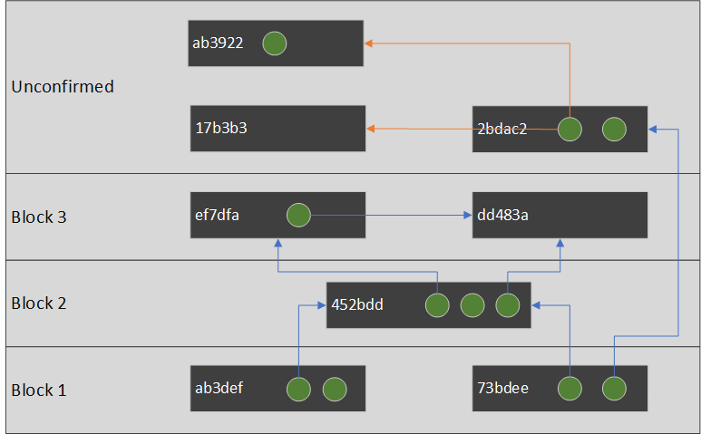
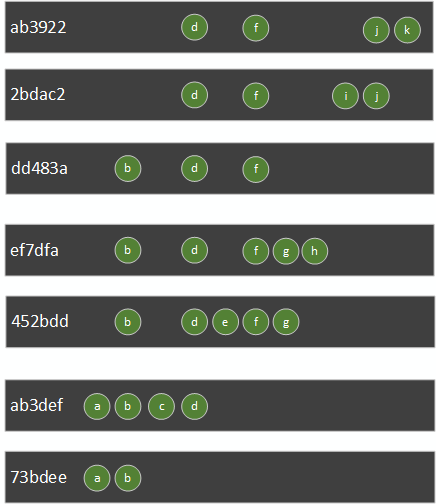

# Advanced wallet design (Theory)

So here are the problem we wish to solve that got problematic in [the previous part](WalletDesign.md) :
* How to handle block reorgs?
* How to handle malleated transactions or double spent?
* How do your prevent address reuse?

Let's see the design of a minimalist UTXO tracker for HD Wallets.

Alice will first ask to our wallet to track her [HD public key](https://programmingblockchain.gitbook.io/programmingblockchain/key_generation/bip_32).

We will then derive new addresses from this HD key, keeping in memory the last path we used for generating an address.

When we receive a transaction (within a block or not), we will check if any input or output match any scriptPubKey our wallet is tracking.

If it match a tracked scriptPubKey of Alice, we will just add this transaction (along with blockHash if any), to the list of Alice's transactions.

Because we have all the transactions of Alice, it can reconstruct the UTXO set of Alice quite easily!

If a transaction was spotted in a block, and that this block is not part of the main chain anymore (reorg), NBXplorer will remove this transaction from the list.

From the resulting list of transactions you can easily build this transaction graph:

* A green dot is an output.
* A gray rectangle is a transaction.
* An arrow from an output to a transaction indicate it is getting spent by another transaction.
* Orange arrows indicate a case of double spending.



Because the transactions form a acyclic graph, you can create a list which represent the nodes of this graph in a topological ordered way. (If transaction A depends on transaction B, then A will be above B in the list)

But what about the double spending case? Which transaction should be in that list? `17b3b3` or `ab3922`?

The answer is easy: the transaction which arrived last is the most likely to be confirmed eventually. This is because we are connected to your trusted full node and your full node would never relay a transaction which conflict with another having more chance to be accepted by miners.

Assuming `ab3922` arrived last, we can remove `17b3b3` from the list before making our topological sort.


Each transactions is basically a modification to the UTXO set. By reading from the oldest transaction to the newest (from bottom to the top), you can see the reconstruction of the UTXO set.



So basically, from the transactions, we could calculate that Alice has 4 UTXOs available to spend: `d`,`f`,`j` and `k`.

Designing a wallet tracker in such way make it easy to handle reorgs. It has also the following advantages:

* To restore the UTXO set of an existing wallet, we do not have to rescan the whole blockchain, it can just scan Bitcoin's UTXO set. (from Bitcoin's core `scantxoutset`)
* A wallet transaction list is prunable. Notice that if we delete `73bdee` from our database, we will compute exactly the same UTXO set at `ab3922`. This mean that even if your wallet has a huge number of transaction and performance slow done, you can just prune this transaction list.
* No complicated logic to handle reorgs, indexing is insert only.

# Advanced wallet design (Practice)

So how the theory would looks like in practice?

Basically we want almost the same code structure than our [RPC example](RPC.md), but instead of using Bitcoin core RPC wallet, we want to use our own wallet based on simplification of NBXplorer design.

In summary, replacing `RPCClient` calls to our own `Wallet` class calls.

```diff
diff --git a/Program.cs b/Program.cs
index 144a0a3..9bd1b84 100644
--- a/Program.cs
+++ b/Program.cs
@@ -28,29 +28,31 @@ namespace NBitcoinTraining
                 Console.WriteLine("Generate 101 blocks so miner can spend money");
                 var minerRPC = miner.CreateRPCClient();
                 miner.Generate(101);
+
+                var aliceWallet = new Wallet(alice.CreateNodeClient());
+                aliceWallet.Listen();

-                var aliceRPC = alice.CreateRPCClient();
                 var bobRPC = bob.CreateRPCClient();
                 var bobAddress = bobRPC.GetNewAddress();

                 Console.WriteLine("Alice gets money from miner");
-                var aliceAddress = aliceRPC.GetNewAddress();
+                var aliceAddress = aliceWallet.GetNewAddress();
                 minerRPC.SendToAddress(aliceAddress, Money.Coins(20m));

                 Console.WriteLine("Mine a block and check that alice is now synched with the miner (same block height)");
                 minerRPC.Generate(1);
-                alice.Sync(miner);
+                aliceWallet.Sync(miner);

-                Console.WriteLine($"Alice Balance: {aliceRPC.GetBalance()}");
+                Console.WriteLine($"Alice Balance: {aliceWallet.GetBalance()}");

                 Console.WriteLine("Alice send 1 BTC to bob");
-                aliceRPC.SendToAddress(bobAddress, Money.Coins(1.0m));
+                aliceWallet.SendToAddress(bobAddress, Money.Coins(1.0m));
                 Console.WriteLine($"Alice mine her own transaction");
-                aliceRPC.Generate(1);
+                alice.CreateRPCClient().Generate(1);

-                alice.Sync(bob);
+                aliceWallet.Sync(bob);

-                Console.WriteLine($"Alice Balance: {aliceRPC.GetBalance()}");
+                Console.WriteLine($"Alice Balance: {aliceWallet.GetBalance()}");
                 Console.WriteLine($"Bob Balance: {bobRPC.GetBalance()}");
             }
         }
```

Program.cs:

```csharp
using System;
using System.Threading;
using NBitcoin;
using NBitcoin.Tests;

namespace NBitcoinTraining
{
    class Program
    {
        static void Main(string[] args)
        {
            // During the first run, this will take time to run, as it download bitcoin core binaries (more than 40MB)
            using (var env = NodeBuilder.Create(NodeDownloadData.Bitcoin.v0_18_0, Network.RegTest))
            {
                // Removing node logs from output
                env.ConfigParameters.Add("printtoconsole", "0");

                var alice = env.CreateNode();
                var bob = env.CreateNode();
                var miner = env.CreateNode();
                env.StartAll();
                Console.WriteLine("Created 3 nodes (alice, bob, miner)");

                Console.WriteLine("Connect nodes to each other");
                miner.Sync(alice, true);
                miner.Sync(bob, true);

                Console.WriteLine("Generate 101 blocks so miner can spend money");
                var minerRPC = miner.CreateRPCClient();
                miner.Generate(101);

                var aliceWallet = new Wallet(alice.CreateNodeClient());
                aliceWallet.Listen();
                
                var bobRPC = bob.CreateRPCClient();
                var bobAddress = bobRPC.GetNewAddress();

                Console.WriteLine("Alice gets money from miner");
                var aliceAddress = aliceWallet.GetNewAddress();
                minerRPC.SendToAddress(aliceAddress, Money.Coins(20m));

                Console.WriteLine("Mine a block and check that alice is now synched with the miner (same block height)");
                minerRPC.Generate(1);
                aliceWallet.Sync(miner);

                Console.WriteLine($"Alice Balance: {aliceWallet.GetBalance()}");

                Console.WriteLine("Alice send 1 BTC to bob");
                aliceWallet.SendToAddress(bobAddress, Money.Coins(1.0m));
                Console.WriteLine($"Alice mine her own transaction");
                alice.CreateRPCClient().Generate(1);

                aliceWallet.Sync(bob);

                Console.WriteLine($"Alice Balance: {aliceWallet.GetBalance()}");
                Console.WriteLine($"Bob Balance: {bobRPC.GetBalance()}");
            }
        }
    }
}
```

So, what should be `Wallet.cs` implementation which just connect to alice's trusted node? Surprisingly simple: 300 lines of code.

This wallet support reorg, conflict and do not reuse addresses.

Of course, this wallet is missing lot's of feature like persistence, but this show you how you can use `NBitcoin` to connect to the P2P network and do your minimalist wallet.

```csharp
using System;
using System.Linq;
using System.Collections;
using System.Collections.Generic;
using System.Collections.Concurrent;
using System.Threading;
using NBitcoin;
using NBitcoin.Protocol;
using NBitcoin.Protocol.Behaviors;
using NBitcoin.Tests;

namespace NBitcoinTraining
{
    // DISCLAIMER: THIS CODE HAS NOT BEEN TESTED THROUGHTFULLY AND SHOULD ONLY
    // BE USED FOR EDUCATIONAL PURPOSE
    public class Wallet
    {
        public class TrackedAddress
        {
            public Script ScriptPubKey { get; set; }
            public KeyPath KeyPath { get; set; }
        }
        public class TrackedTransaction
        {
            public uint256 BlockHash { get; set; }
            public Transaction Transaction { get; set; }
            public DateTimeOffset Timestamp { get; set; }
            public uint256 TransactionHash { get; set; }
            public IEnumerable<OutPoint> SpentOutpoints => Transaction.IsCoinBase ? Array.Empty<OutPoint>() : Transaction.Inputs.Select(i => i.PrevOut);
        }
        Node trustedNode;
        SlimChain headerChain;

        BitcoinExtKey aliceKey;
        KeyPath nextAddressPath = new KeyPath(0);

        Network network => trustedNode.Network;
        ConcurrentDictionary<Script, TrackedAddress> trackedAddresses = new ConcurrentDictionary<Script, TrackedAddress>();
        ConcurrentDictionary<uint256, TrackedTransaction> trackedTransactions = new ConcurrentDictionary<uint256, TrackedTransaction>();


        public Wallet(Node trustedNode)
        {
            this.trustedNode = trustedNode;
            this.aliceKey = new ExtKey().GetWif(trustedNode.Network);
        }

        public void Listen()
        {
            // This make sure headerChain has all the block headers of the remote node
            headerChain = this.trustedNode.GetSlimChain();
            // This make sure headerChain has all the block headers of the remote node, and keep in sync!
            this.trustedNode.Behaviors.Add(new SlimChainBehavior(headerChain));
            this.trustedNode.MessageReceived += OnMessageReceived;
        }

        private void OnMessageReceived(Node node, IncomingMessage message)
        {
            if (message.Message.Payload is BlockPayload blockPayload)
            {
                var blockHash = blockPayload.Object.GetHash();
                foreach (var tx in blockPayload.Object.Transactions)
                {
                    CheckTx(blockHash, tx);
                }
            }
            if (message.Message.Payload is TxPayload txPayload)
            {
                CheckTx(null, txPayload.Object);
            }
            if (message.Message.Payload is InvPayload inv)
            {
                // They announce some txid or blockhash, let's ask full data
                node.SendMessageAsync(new GetDataPayload(inv.ToArray()));
            }
        }

        internal void Sync(CoreNode bob)
        {
            var rpc = bob.CreateRPCClient();
            while (rpc.GetBestBlockHash() != headerChain.Tip)
            {
                Thread.Sleep(100);
            }
        }

        private void CheckTx(uint256 blockHash, Transaction tx)
        {
            if(!IsMyTx(tx))
                return;
            var confirmed = blockHash == null ? "unconfirmed" : "confirmed";
            System.Console.WriteLine($"Received TX {tx.GetHash()} {confirmed}");
            var tracked = new TrackedTransaction()
            {
                Transaction = tx,
                TransactionHash = tx.GetHash(),
                Timestamp = DateTimeOffset.UtcNow,
                BlockHash = blockHash
            };
            trackedTransactions.TryAdd(tracked.TransactionHash, tracked);
        }

        bool IsMyTx(Transaction tx)
        {
            if (!tx.IsCoinBase)
            {
                foreach (var input in tx.Inputs)
                {
                    var signerScriptPubKey = input.ScriptSig.GetSigner()?.ScriptPubKey;
                    if (signerScriptPubKey != null && trackedAddresses.ContainsKey(signerScriptPubKey))
                        return true;
                }
            }
            foreach (var output in tx.Outputs)
            {
                if(trackedAddresses.ContainsKey(output.ScriptPubKey))
                    return true;
            }
            return false;
        }

        (KeyPath KeyPath, Coin Coin)[] GetUTXOs()
        {
            var transactionsById = new Dictionary<uint256, AnnotatedTransaction>();

            List<TrackedTransaction> ignoredTransactions = new List<TrackedTransaction>();

            // Let's remove the dups and let's get the current height of the transactions
			foreach (var trackedTx in trackedTransactions.Values)
			{
				int? txHeight = null;
				bool isMature = true;

				if (trackedTx.BlockHash != null && headerChain.TryGetHeight(trackedTx.BlockHash, out var height))
				{
					txHeight = height;
					isMature = trackedTx.Transaction.IsCoinBase ? headerChain.Height - height >= network.Consensus.CoinbaseMaturity : true;
				}

				var annotatedTransaction = new AnnotatedTransaction(txHeight, trackedTx, isMature);
				if (transactionsById.TryGetValue(trackedTx.Transaction.GetHash(), out var conflicted))
				{
					if (ShouldReplace(annotatedTransaction, conflicted))
					{
						ignoredTransactions.Add(conflicted.TrackedTransaction);
						transactionsById.Remove(trackedTx.Transaction.GetHash());
						transactionsById.Add(trackedTx.Transaction.GetHash(), annotatedTransaction);
					}
					else
					{
						ignoredTransactions.Add(annotatedTransaction.TrackedTransaction);
					}
				}
				else
				{
					transactionsById.Add(trackedTx.Transaction.GetHash(), annotatedTransaction);
				}
			}

            // Let's resolve the double spents
			Dictionary<OutPoint, uint256> spentBy = new Dictionary<OutPoint, uint256>();
			foreach (var annotatedTransaction in transactionsById.Values.Where(r => r.Height is int))
			{
				foreach (var spent in annotatedTransaction.TrackedTransaction.SpentOutpoints)
				{
					// No way to have double spent in confirmed transactions
					spentBy.Add(spent, annotatedTransaction.TrackedTransaction.TransactionHash);
				}
			}

            List<AnnotatedTransaction> replacedTransactions = new List<AnnotatedTransaction>();
            removeConflicts:
			HashSet<uint256> conflicts = new HashSet<uint256>();
			foreach (var annotatedTransaction in transactionsById.Values.Where(r => r.Height is null))
			{
				foreach (var spent in annotatedTransaction.TrackedTransaction.SpentOutpoints)
				{
					if (spentBy.TryGetValue(spent, out var conflictHash) &&
						transactionsById.TryGetValue(conflictHash, out var conflicted))
					{
						if (conflicted == annotatedTransaction)
							goto nextTransaction;
						if (conflicts.Contains(conflictHash))
						{
							spentBy.Remove(spent);
							spentBy.Add(spent, annotatedTransaction.TrackedTransaction.TransactionHash);
						}
						else if (ShouldReplace(annotatedTransaction, conflicted))
						{
							conflicts.Add(conflictHash);
							spentBy.Remove(spent);
							spentBy.Add(spent, annotatedTransaction.TrackedTransaction.TransactionHash);

							if (conflicted.Height is null && annotatedTransaction.Height is null)
							{
								replacedTransactions.Add(conflicted);
							}
							else
							{
								ignoredTransactions.Add(conflicted.TrackedTransaction);
							}
						}
						else
						{
							conflicts.Add(annotatedTransaction.TrackedTransaction.TransactionHash);
							if (conflicted.Height is null && annotatedTransaction.Height is null)
							{
								replacedTransactions.Add(annotatedTransaction);
							}
							else
							{
								ignoredTransactions.Add(annotatedTransaction.TrackedTransaction);
							}
						}
					}
					else
					{
						spentBy.Add(spent, annotatedTransaction.TrackedTransaction.TransactionHash);
					}
				}
			nextTransaction:;
			}

			foreach (var e in conflicts)
				transactionsById.Remove(e);
			if (conflicts.Count != 0)
				goto removeConflicts;

            // Let's clean the removed transactions so they don't appear during next request
            foreach (var removed in conflicts)
            {
                trackedTransactions.Remove(removed, out _);
            }

            // Topological sort
            var sortedTrackedTransactions = transactionsById.Values.TopologicalSort();

            // Calculate the UTXO set
            var utxos = new Dictionary<OutPoint, (KeyPath KeyPath, Coin Coin)>();
            foreach (var trackedTx in sortedTrackedTransactions)
            {
                 
                foreach (var spent in trackedTx.TrackedTransaction.SpentOutpoints)
                {
                    utxos.Remove(spent);
                }
                
                foreach (var output in trackedTx.TrackedTransaction.Transaction.Outputs.AsCoins())
                {
                    if(trackedAddresses.TryGetValue(output.ScriptPubKey, out var trackedAddress))
                    {
                        utxos.TryAdd(output.Outpoint, (trackedAddress.KeyPath, output));
                    }
                }
            }

            // Remove all ignored transaction from the datase
            foreach (var ignored in ignoredTransactions)
            {
                trackedTransactions.Remove(ignored.TransactionHash, out _);
            }
            return utxos.Values.ToArray();
        }

        private bool ShouldReplace(AnnotatedTransaction annotatedTransaction, AnnotatedTransaction conflicted)
        {
            	if (annotatedTransaction.Height is int &&
				conflicted.Height is null)
			{
				return true;
			}
			else if (annotatedTransaction.Height is null &&
					 conflicted.Height is null &&
					 annotatedTransaction.TrackedTransaction.Timestamp > conflicted.TrackedTransaction.Timestamp)
			{
				return true;
			}

			return false;
        }

        public void SendToAddress(BitcoinAddress address, Money amount)
        {
            var utxos = GetUTXOs();
            var change = GetNewAddress();
            var builder = network.CreateTransactionBuilder();
            builder.AddCoins(utxos.Select(u => u.Coin).ToArray());
            builder.AddKeys(utxos.Select(u => aliceKey.Derive(u.KeyPath)).ToArray());
            builder.Send(address, amount);
            builder.SetChange(change);
            builder.SendFees(Money.Coins(0.0001m));
            var tx = builder.BuildTransaction(true);
            using (var listener = trustedNode.CreateListener())
            {
                trustedNode.SendMessageAsync(new InvPayload(tx)); // Anounce the tx
                listener.ReceivePayload<GetDataPayload>();  // wait the node ask for it
                trustedNode.SendMessageAsync(new TxPayload(tx)); // Broadcast

                // Old trick to be sure the trustedNode processed our transaction
                trustedNode.SendMessageAsync(new PingPayload());
                listener.ReceivePayload<PongPayload>();
            }
            System.Console.WriteLine($"TX Created {tx.GetHash()}");
            var trackedTx = new TrackedTransaction()
            {
               Timestamp = DateTimeOffset.UtcNow,
               Transaction = tx,
               TransactionHash = tx.GetHash()
            };
            trackedTransactions.TryAdd(trackedTx.TransactionHash, trackedTx);
        }

        public Money GetBalance()
        {
            return GetUTXOs().Select(c => c.Coin.TxOut.Value).Sum();
        }

        public BitcoinAddress GetNewAddress()
        {
            var address = aliceKey.Derive(nextAddressPath).GetPublicKey().GetAddress(ScriptPubKeyType.Legacy, network);
            trackedAddresses.TryAdd(address.ScriptPubKey, new TrackedAddress() { ScriptPubKey = address.ScriptPubKey, KeyPath = nextAddressPath });
            nextAddressPath = nextAddressPath.Increment();
            return address;
        }
    }

    class AnnotatedTransaction
    {
        public AnnotatedTransaction(int? height, TrackedTransaction transaction, bool isMature)
        {
            Height = height;
            TrackedTransaction = transaction;
            IsMature = isMature;
        }
        public int? Height { get; set; }
        public TrackedTransaction TrackedTransaction { get; set; }
        public bool IsMature { get; set; }
    }
}
```

Our topological sort code is (`TopologicalSort.cs`):

```csharp
using System;
using System.Linq;
using System.Collections.Generic;

namespace NBitcoinTraining
{
    public static class TopologicalSortExtensions
    {
	    public static ICollection<AnnotatedTransaction> TopologicalSort(this ICollection<AnnotatedTransaction> transactions)
		{
			return transactions.TopologicalSort(
				dependsOn: t => t.TrackedTransaction.SpentOutpoints.Select(o => o.Hash), 
                getKey: t => t.TrackedTransaction.TransactionHash
				getValue: t => t,
				solveTies: AnnotatedTransactionComparer.OldToYoung);
		}
		public static List<T> TopologicalSort<T>(this ICollection<T> nodes, Func<T, IEnumerable<T>> dependsOn)
		{
			return nodes.TopologicalSort(dependsOn, k => k, k => k);
		}

		public static List<T> TopologicalSort<T, TDepend>(this ICollection<T> nodes, Func<T, IEnumerable<TDepend>> dependsOn, Func<T, TDepend> getKey)
		{
			return nodes.TopologicalSort(dependsOn, getKey, o => o);
		}

		public static List<TValue> TopologicalSort<T, TDepend, TValue>(this ICollection<T> nodes,
												Func<T, IEnumerable<TDepend>> dependsOn,
												Func<T, TDepend> getKey,
												Func<T, TValue> getValue,
												IComparer<T> solveTies = null)
		{
			if (nodes.Count == 0)
				return new List<TValue>();
			if (getKey == null)
				throw new ArgumentNullException(nameof(getKey));
			if (getValue == null)
				throw new ArgumentNullException(nameof(getValue));
			solveTies = solveTies ?? Comparer<T>.Default;
			List<TValue> result = new List<TValue>(nodes.Count);
			HashSet<TDepend> allKeys = new HashSet<TDepend>(nodes.Count);
			var noDependencies = new SortedDictionary<T, HashSet<TDepend>>(solveTies);

			foreach (var node in nodes)
				allKeys.Add(getKey(node));
			var dependenciesByValues = nodes.ToDictionary(node => node,
										   node => new HashSet<TDepend>(dependsOn(node).Where(n => allKeys.Contains(n))));
			foreach (var e in dependenciesByValues.Where(x => x.Value.Count == 0))
			{
				noDependencies.Add(e.Key, e.Value);
			}
			if (noDependencies.Count == 0)
			{
				throw new InvalidOperationException("Impossible to topologically sort a cyclic graph");
			}
			while (noDependencies.Count > 0)
			{
				var nodep = noDependencies.First();
				noDependencies.Remove(nodep.Key);
				dependenciesByValues.Remove(nodep.Key);

				var elemKey = getKey(nodep.Key);
				result.Add(getValue(nodep.Key));
				foreach (var selem in dependenciesByValues)
				{
					if (selem.Value.Remove(elemKey) && selem.Value.Count == 0)
						noDependencies.Add(selem.Key, selem.Value);
				}
			}
			if (dependenciesByValues.Count != 0)
			{
				throw new InvalidOperationException("Impossible to topologically sort a cyclic graph");
			}
			return result;
		}
    }

    public class AnnotatedTransactionComparer : IComparer<AnnotatedTransaction>
	{
		bool youngToOld;
		AnnotatedTransactionComparer(bool youngToOld)
		{
			this.youngToOld = youngToOld;
		}
		private static readonly AnnotatedTransactionComparer _Youngness = new AnnotatedTransactionComparer(true);
		public static AnnotatedTransactionComparer YoungToOld
		{
			get
			{
				return _Youngness;
			}
		}
		private static readonly AnnotatedTransactionComparer _Oldness = new AnnotatedTransactionComparer(false);
		public static AnnotatedTransactionComparer OldToYoung
		{
			get
			{
				return _Oldness;
			}
		}
		public AnnotatedTransactionComparer Inverse()
		{
			return this == YoungToOld ? OldToYoung : YoungToOld;
		}
		public int Compare(AnnotatedTransaction a, AnnotatedTransaction b)
		{
			var result = CompareCore(a, b);
			if (!youngToOld)
				result = result * -1;
			return result;
		}
		int CompareCore(AnnotatedTransaction a, AnnotatedTransaction b)
		{
			var txIdCompare = a.Record.TransactionHash < b.Record.TransactionHash ? -1 :
							  a.Record.TransactionHash > b.Record.TransactionHash ? 1 : 0;
			var seenCompare = (a.Record.FirstSeen < b.Record.FirstSeen ? 1 :
							a.Record.FirstSeen > b.Record.FirstSeen ? -1 : txIdCompare);
			if (a.Height is int ah)
			{
				// Both confirmed, tie on height then firstSeen
				if (b.Height is int bh)
				{
					var heightCompare = (ah < bh ? 1 :
						   ah > bh ? -1 : txIdCompare);
					return ah == bh ?
						   // same height? use firstSeen on firstSeen
						   seenCompare :
						   // else tie on the height
						   heightCompare;
				}
				else
				{
					return 1;
				}
			}
			else if (b.Height is int bh)
			{
				return -1;
			}
			// Both unconfirmed, tie on firstSeen
			else
			{
				return seenCompare;
			}
		}
	}
}
```

And our output is as expected:

```
Alice gets money from miner
Mine a block and check that alice is now synched with the miner (same block height)
Received TX 60ec882fb997437af4d8301d050f7c00976aa3362382f5ec1e45c8261164e1e5 confirmed
Alice Balance: 20.00000000
Alice send 1 BTC to bob
TX Created 7a7b83260565646219c362255718f61cd9ef73ca4f4e3398d56b73d50fd8e220
Alice mine her own transaction
Received TX 7a7b83260565646219c362255718f61cd9ef73ca4f4e3398d56b73d50fd8e220 confirmed
Alice Balance: 18.99990000
Bob Balance: 1.00000000
```

You will need time to study the code above, but it is not doing anything fundamentally different from the theory I explained.

Now you understand the theory and the practice, for most project, you will not need to do your own wallet tracker!

In the following chapter, we will see how to use an open source one based on NBitcoin, [NBXplorer](https://github.com/dgarage/NBXplorer/). 

NBXplorer has the same design that we saw, but also have the following features:
* Can pass arguments via environment variable, command line or configuration file
* Automatically reconnect to your node if the connection goes temporarily down
* An easy to use REST API
* Persistence (via in-file no-SQL datbase called DBreeze)
* Connect via RPC to broadcast transaction instead of using the P2P protocol like this example
* Connect via RPC to your trusted node to get the proper fee rate.
* Altcoin support
* Huge test suite
* Pruning of transaction data (in practice, we don't need to save the whole transaction, only the spent outpoint and received coin for the wallet)
* Multi-wallet
* Flexible address generation schemes (multisig, segwit, legacy etc...)
* Pruning for big wallets (Removal of tracked transaction which do not impact the resulting UTXO set)

