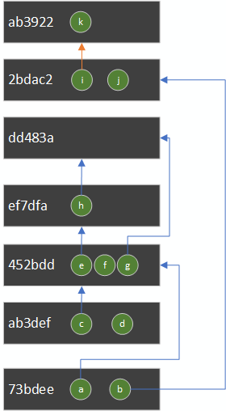

# Introduction

What a long road. I started writing NBitcoin in 2014 in order to learn about Bitcoin, this was being done by copy and pasting code from BitcoinJ and Bitcoin Core, along with their test suite and making sure it worked in .NET.

Along the road I learned about Bitcoin. I am the kind of programmer who can't learn something without coding it first.
As I learned about Bitcoin, I started writing [Programming The Blockchain in C#](https://programmingblockchain.gitbooks.io/programmingblockchain/content/) on a word document. Along the road, nopara73, joined me and transfered it to Github and GitBook and rewrote lot's of content.

Since then lot's of community member improved the book, that's the beauty of github.

If you want to learn conceptually about Bitcoin, I advice you to read [Programming The Blockchain in C#](https://programmingblockchain.gitbooks.io/programmingblockchain/content/) first before reading this documentation.

[Programming The Blockchain in C#](https://programmingblockchain.gitbooks.io/programmingblockchain/content/) introduces you primitive concept of Bitcoin which are useful whichever language you end up writing bitcoin.

This book is about programming with NBitcoin you will learn additional concept, not covered in [Programming The Blockchain in C#](https://programmingblockchain.gitbooks.io/programmingblockchain/content/), and mainly how to use them in NBitcoin.

NBitcoin is a tool I use everyday for other projects, be it closed source project or open source project (like [BTCPay Server](https://docs.btcpayserver.org)). This mean that there is a very tight feedback loop.

The process is about:
* Add a new feature on NBitcoin
* Use such feature for another project
* Finding the pain points of using this feature
* Fixing NBitcoin to make the use case easier to code

This feedback loop sometimes take 10 min. This is why NBitcoin has today 604 releases.

This mean that you can be sure that NBitcoin is the easiest library to use for bitcoin development. If it was not, I would shot myself in the foot.

This book will allow me to explain the design of NBitcoin which has been shaped by my direct experience into using NBitcoin.

This book is about practical development, so I expect you to open visual studio, understand concepts, run and debug the code snippets.
Once you understand, you need to apply the concept on whatever project you want to work on.

# Development setup

Because this book is meant to be used for people using Windows, Linux or Mac OS, we advise you to use [Visual studio Code](https://code.visualstudio.com/).

Download and install the last version of [.NET Core SDK](https://dotnet.microsoft.com/download).

Then create your first project and add `NBitcoin` and `NBitcoin.TestFramework`.
```bash
mkdir NBitcoinTraining
cd NBitcoinTraining
dotnet new console
dotnet add package NBitcoin
dotnet add package NBitcoin.TestFramework
```

Then open the folder with Visual Studio Code.

```bash
code .
```

You can then put breakpoints and debug from inside Visual studio code. You can hit F5 to run your code.
This might ask you to install the extension `C# for Visual Studio Code (powered by OmniSharp)`.

# NBitcoin's test framework: Alice sends through Bob through Bitcoin RPC

When developing on Bitcoin, it is critical to be able to easily run your code to verify it works properly.
This is what we will use in all our tests. This is the goal of the `NBitcoin.TestFramework` package.

This library allows you to create a network of node and connect them to one another.
Let's see an example, it may takes a while to run at first because Bitcoin Core binaries, please feel free to debug step by step:

`Miner` give some money to `Alice` which gives 1 BTC to `Bob`.

```csharp
using System;
using System.Threading;
using NBitcoin;
using NBitcoin.Tests;

namespace NBitcoinTraining
{
    class Program
    {
        static void Main(string[] args)
        {
            // During the first run, this will take time to run, as it download bitcoin core binaries (more than 40MB)
            using (var env = NodeBuilder.Create(NodeDownloadData.Bitcoin.v0_18_0, Network.RegTest))
            {
                // Removing node logs from output
                env.ConfigParameters.Add("printtoconsole", "0");

                var alice = env.CreateNode();
                var bob = env.CreateNode();
                var miner = env.CreateNode();
                env.StartAll();
                Console.WriteLine("Created 3 nodes (alice, bob, miner)");

                Console.WriteLine("Connect nodes to each other");
                miner.Sync(alice, true);
                miner.Sync(bob, true);

                Console.WriteLine("Generate 101 blocks so miner can spend money");
                var minerRPC = miner.CreateRPCClient();
                miner.Generate(101);
                
                var aliceRPC = alice.CreateRPCClient();
                var bobRPC = bob.CreateRPCClient();
                var bobAddress = bobRPC.GetNewAddress();

                Console.WriteLine("Alice get money from miner");
                var aliceAddress = aliceRPC.GetNewAddress();
                minerRPC.SendToAddress(aliceAddress, Money.Coins(20m));

                Console.WriteLine("Mine a block and check that alice is now synched with the miner (same block height)");
                minerRPC.Generate(1);
                alice.Sync(miner);

                Console.WriteLine($"Alice Balance: {aliceRPC.GetBalance()}");

                Console.WriteLine("Alice send 1 BTC to bob");
                aliceRPC.SendToAddress(bobAddress, Money.Coins(1.0m));
                Console.WriteLine($"Alice mine her own transaction");
                aliceRPC.Generate(1);

                alice.Sync(bob);

                Console.WriteLine($"Alice Balance: {aliceRPC.GetBalance()}");
                Console.WriteLine($"Bob Balance: {bobRPC.GetBalance()}");
            }
        }
    }
}
```

This will output the following:

```
Created 3 nodes (alice, bob, miner)
Connect nodes to each other
Generate 101 blocks so miner can spend money
Alice get money from miner
Mine a block and check that alice is now synched with the miner (same block height)
Alice Balance: 20.00000000
Alice send 1 BTC to bob
Alice mine her own transaction
Alice Balance: 18.99996680
Bob Balance: 1.00000000
```

We encourage you to run this example several time, try to play with the code.
One trick you will often see is that when `Alice` send money to Bob, she mines her own transaction and make sure Bob is aware of this block.

This is done this way because when Alice create a transaction, it would take time to propagate to `Bob`, so we would need to put some sleep in the code. Instead, we just get `Alice` to mine her own transaction and make sure `Bob` received it. Then we can be sure the balance has been updated.

You will use this trick a lot during your development.

# Debugging inside NBitcoin

NBitcoin is published with symbols so that Visual Studio Code can fetch sources from github and you can easily debug inside NBitcoin library easily.

## In Visual Studio Code

Inside your `.vscode/launch.json`, add the following to .NET Core Launch (console) configuration:
```json
"justMyCode": false,
"symbolOptions": {
    "searchPaths": [ "https://symbols.nuget.org/download/symbols" ],
    "searchMicrosoftSymbolServer": true
},
```

For example, here is my own `launch.json`:

```json
{
   "version": "0.2.0",
   "configurations": [
        {
            "name": ".NET Core Launch (console)",
            "type": "coreclr",
            "request": "launch",
            "preLaunchTask": "build",
            "program": "${workspaceFolder}/bin/Debug/netcoreapp2.2/NBitcoinTraining.dll",
            "args": [],
            "cwd": "${workspaceFolder}",
            "console": "internalConsole",
            "stopAtEntry": false,
            "justMyCode": false,
            "symbolOptions": {
                "searchPaths": [ "https://symbols.nuget.org/download/symbols" ],
                "searchMicrosoftSymbolServer": true
            }
        },
        {
            "name": ".NET Core Attach",
            "type": "coreclr",
            "request": "attach",
            "processId": "${command:pickProcess}"
        }
    ]
}
```

Now, when I debug into Visual Studio Code, I can step inside NBitcoin's source code. (with `F11` while breaking)

We advise you to re-enable `Enable Just My Code` when you are done. Because Loading symbols can be quite time consuming.

## In Visual Studio

You need to run at least Visual Studio 15.9. Then, you need to:

* `Go in Tools / Options / Debugging / General` and turn **off** `Enable Just My Code`.
* `Go in Tools / Options / Debugging / Symbols` and add `https://symbols.nuget.org/download/symbols` to the `Symbol file (.pdb) locations`, make sure it is checked.

You should also check `Microsoft Symbol Server` or your debugging experience in visual studio will be slowed down.

Now you can Debug your project and step inside any call to NBitcoin under visual studio.

We advise you to re-enable `Enable Just My Code` when you are done. Because Loading symbols can be quite time consuming.

# Alice sends through Bob without RPC

In the previous section, we saw how `Alice` can send to `Bob` with the `NBitcoin.TestFramework` library.
This is all well and good, but in many cases, Bitcoin RPC can be very limited and inflexible in term of feature.

So let's try to achieve the same goal as in the previous chapter, but this time, without using RPC on Alice's side.

Let's change the diff and the whole source code:

```diff
diff --git a/Program.cs b/Program.cs
index 144a0a3..b9b4983 100644
--- a/Program.cs
+++ b/Program.cs
@@ -1,4 +1,6 @@
 using System;
+using System.Linq;
+using System.Collections.Generic;
 using System.Threading;
 using NBitcoin;
 using NBitcoin.Tests;
@@ -15,42 +17,68 @@ namespace NBitcoinTraining
                 // Removing node logs from output
                 env.ConfigParameters.Add("printtoconsole", "0");

-                var alice = env.CreateNode();
                 var bob = env.CreateNode();
                 var miner = env.CreateNode();
+                miner.ConfigParameters.Add("txindex", "1"); // So we can query a tx from txid
                 env.StartAll();
                 Console.WriteLine("Created 3 nodes (alice, bob, miner)");

                 Console.WriteLine("Connect nodes to each other");
-                miner.Sync(alice, true);
                 miner.Sync(bob, true);

                 Console.WriteLine("Generate 101 blocks so miner can spend money");
                 var minerRPC = miner.CreateRPCClient();
                 miner.Generate(101);

-                var aliceRPC = alice.CreateRPCClient();
                 var bobRPC = bob.CreateRPCClient();
                 var bobAddress = bobRPC.GetNewAddress();

                 Console.WriteLine("Alice get money from miner");
-                var aliceAddress = aliceRPC.GetNewAddress();
-                minerRPC.SendToAddress(aliceAddress, Money.Coins(20m));
+                var aliceKey = new Key();
+                var aliceAddress = aliceKey.PubKey.GetAddress(Network.RegTest);
+                var minerToAliceTxId = minerRPC.SendToAddress(aliceAddress, Money.Coins(20m));

                 Console.WriteLine("Mine a block and check that alice is now synched with the miner (same block height)");
                 minerRPC.Generate(1);
-                alice.Sync(miner);
+                
+                var minerToAliceTx = minerRPC.GetRawTransaction(minerToAliceTxId);
+                var aliceUnspentCoins = minerToAliceTx.Outputs.AsCoins()
+                                .Where(c => c.ScriptPubKey == aliceAddress.ScriptPubKey)
+                                .ToDictionary(c => c.Outpoint, c => c);

-                Console.WriteLine($"Alice Balance: {aliceRPC.GetBalance()}");
+                Console.WriteLine($"Alice Balance: {aliceUnspentCoins.Select(c => c.Value.TxOut.Value).Sum()}");

                 Console.WriteLine("Alice send 1 BTC to bob");
-                aliceRPC.SendToAddress(bobAddress, Money.Coins(1.0m));
-                Console.WriteLine($"Alice mine her own transaction");
-                aliceRPC.Generate(1);

-                alice.Sync(bob);
+                var txBuilder = Network.RegTest.CreateTransactionBuilder();
+                var aliceToBobTx = txBuilder.AddKeys(aliceKey)
+                         .AddCoins(aliceUnspentCoins.Values)
+                         .Send(bobAddress, Money.Coins(1.0m))
+                         .SetChange(aliceAddress)
+                         .SendFees(Money.Coins(0.00001m))
+                         .BuildTransaction(true);
+
+                Console.WriteLine($"Alice broadcast to miner");
+                minerRPC.SendRawTransaction(aliceToBobTx);
+
+                foreach (var input in aliceToBobTx.Inputs)
+                {
+                    // Let's remove what alice spent
+                    aliceUnspentCoins.Remove(input.PrevOut);
+                }
+                foreach (var output in aliceToBobTx.Outputs.AsCoins())
+                {
+                    if (output.ScriptPubKey == aliceAddress.ScriptPubKey)
+                    {
+                        // Let's add what alice received
+                        aliceUnspentCoins.Add(output.Outpoint, output);
+                    }
+                }
+
+                miner.Generate(1);
+                miner.Sync(bob);

-                Console.WriteLine($"Alice Balance: {aliceRPC.GetBalance()}");
+                Console.WriteLine($"Alice Balance: {aliceUnspentCoins.Select(c => c.Value.TxOut.Value).Sum()}");
                 Console.WriteLine($"Bob Balance: {bobRPC.GetBalance()}");
             }
         }
```

The source code is now:

```csharp
using System;
using System.Linq;
using System.Collections.Generic;
using System.Threading;
using NBitcoin;
using NBitcoin.Tests;

namespace NBitcoinTraining
{
    class Program
    {
        static void Main(string[] args)
        {
            // During the first run, this will take time to run, as it download bitcoin core binaries (more than 40MB)
            using (var env = NodeBuilder.Create(NodeDownloadData.Bitcoin.v0_18_0, Network.RegTest))
            {
                // Removing node logs from output
                env.ConfigParameters.Add("printtoconsole", "0");

                var bob = env.CreateNode();
                var miner = env.CreateNode();
                miner.ConfigParameters.Add("txindex", "1"); // So we can query a tx from txid
                env.StartAll();
                Console.WriteLine("Created 3 nodes (alice, bob, miner)");

                Console.WriteLine("Connect nodes to each other");
                miner.Sync(bob, true);

                Console.WriteLine("Generate 101 blocks so miner can spend money");
                var minerRPC = miner.CreateRPCClient();
                miner.Generate(101);
                
                var bobRPC = bob.CreateRPCClient();
                var bobAddress = bobRPC.GetNewAddress();

                Console.WriteLine("Alice get money from miner");
                var aliceKey = new Key();
                var aliceAddress = aliceKey.PubKey.GetAddress(Network.RegTest);
                var minerToAliceTxId = minerRPC.SendToAddress(aliceAddress, Money.Coins(20m));

                Console.WriteLine("Mine a block and check that alice is now synched with the miner (same block height)");
                minerRPC.Generate(1);
                
                var minerToAliceTx = minerRPC.GetRawTransaction(minerToAliceTxId);
                var aliceUnspentCoins = minerToAliceTx.Outputs.AsCoins()
                                .Where(c => c.ScriptPubKey == aliceAddress.ScriptPubKey)
                                .ToDictionary(c => c.Outpoint, c => c);

                Console.WriteLine($"Alice Balance: {aliceUnspentCoins.Select(c => c.Value.TxOut.Value).Sum()}");

                Console.WriteLine("Alice send 1 BTC to bob");

                var txBuilder = Network.RegTest.CreateTransactionBuilder();
                var aliceToBobTx = txBuilder.AddKeys(aliceKey)
                         .AddCoins(aliceUnspentCoins.Values)
                         .Send(bobAddress, Money.Coins(1.0m))
                         .SetChange(aliceAddress)
                         .SendFees(Money.Coins(0.00001m))
                         .BuildTransaction(true);

                Console.WriteLine($"Alice broadcast to miner");
                minerRPC.SendRawTransaction(aliceToBobTx);

                foreach (var input in aliceToBobTx.Inputs)
                {
                    // Let's remove what alice spent
                    aliceUnspentCoins.Remove(input.PrevOut);
                }
                foreach (var output in aliceToBobTx.Outputs.AsCoins())
                {
                    if (output.ScriptPubKey == aliceAddress.ScriptPubKey)
                    {
                        // Let's add what alice received
                        aliceUnspentCoins.Add(output.Outpoint, output);
                    }
                }

                miner.Generate(1);
                miner.Sync(bob);

                Console.WriteLine($"Alice Balance: {aliceUnspentCoins.Select(c => c.Value.TxOut.Value).Sum()}");
                Console.WriteLine($"Bob Balance: {bobRPC.GetBalance()}");
            }
        }
    }
}
```

The output is basically the same as the previous chapter.

```
Created 3 nodes (alice, bob, miner)
Connect nodes to each other
Generate 101 blocks so miner can spend money
Alice get money from miner
Mine a block and check that alice is now synched with the miner (same block height)
Alice Balance: 20.00000000
Alice send 1 BTC to bob
Alice broadcast to miner
Alice Balance: 18.99999000
Bob Balance: 1.00000000
```

Now this solution is not an improvement over the previous `"Alice sends through Bob through Bitcoin RPC"`. The code is harder to read, and you need to keep track of Alice's unspent coins through `aliceUnspentCoins`, here is some problems:

* What if blocks reorgs?
* What if Alice transaction get malleated or double spent?
* How do your prevent address reuse?

However, can you feel the power of having signed a transaction without relying on any software?

# NBXplorer design

So here are the problem we wish to solve that got problematic in the part `"Alice sends through Bob without Bitcoin RPC"`:
* How to handle block reorgs?
* How to handle malleated transactions or double spent?
* How do your prevent address reuse?

We will use for this a middleware called [NBXplorer](https://github.com/dgarage/NBXplorer/).
The description says:

> A minimalist UTXO tracker for HD Wallets. The goal is to have a flexible, .NET based UTXO tracker for HD wallets. The explorer supports P2SH,P2PKH,P2WPKH,P2WSH and Multi-sig derivation.

It has an easy to use [API](https://github.com/dgarage/NBXplorer/blob/master/docs/API.md), and can run on pruned node.

It is however important to understand how NBXplorer has been designed so you get a better understanding on what you can do with it.
Also, in some case, you might want to do your own UTXO tracker and you may be interested in its design.

NBXplorer just connect to a trusted bitcoin full node. 

Alice will first ask to NBXplorer to track her [HD public key](https://programmingblockchain.gitbook.io/programmingblockchain/key_generation/bip_32).

NBXplorer, will then generate all the scriptPubKey along `0/x`, `1/x` and `x` path, and save them in database.

When NBXplorer receives a transaction (within a block or not), it will check all if any input or output match any scriptPubKey it is tracking.

If it match a tracked scriptPubKey of Alice, then NBXplorer will just add this transaction (along with blockHash if any), to the list of Alice's transactions.

Because NBXplorer has all the transactions of Alice, it can reconstruct the UTXO set of Alice quite easily!

When you query the UTXO set from NBXplorer retrieves all the transactions from Alice.

If a transaction was spotted in a block, and that this block is not part of the main chain anymore (reorg), NBXplorer will remove this transaction from the list.

From the resulting list of transaction you can easily build this transaction graph:

* A green dot is an output.
* A gray rectangle is a transaction.
* An arrow from an output to a transaction indicate it is getting spent by another transaction.
* Orange arrows indicate a case of double spending.


Because the transactions form a acyclic graph, you can create a list which represent the nodes of this graph in a topological ordered way. (If transaction A depends on transaction B, then A will be above B in the list)

But what about the double spending case? Which transaction should be in that list? `17b3b3` or `ab3922`?

The answer is easy: the transaction which arrived last is the most likely to be confirmed eventually. This is because NBXplorer is connected to your trusted full node and your full node would never relay a transaction which conflict with another having more chance to be accepted by miners.

Assuming `ab3922` arrived last, we can make our list.




Each time you play a transaction, it makes a modification to the UTXO set. (Read from bottom to the top)


So basically, from the transactions, we could calculate that Alice has 4 UTXOs available to spend: `d`,`f`,`j` and `k`.

Designing a wallet tracker in such way make it easy to handle reorgs. It has also the following advantages:

* To restore the UTXO set of an existing wallet, NBXplorer does not have to rescan the whole blockchain, it can just scan Bitcoin's UTXO set. (from Bitcoin's core `scantxoutset`)
* A wallet transaction list is prunable. Notice that if we delete `73bdee` from our database, we will compute exactly the same UTXO set at `ab3922`. This mean that even if your wallet has a huge number of transaction and performance slow done, you can just prune this transaction list.
* No complicated logic to handle reorgs, indexing is insert only.

# NBXplorer design in a nutshell

If you wanted to do your own wallet tracker (without relying on NBXplorer), how would it looks like?

Basically we want almost the same code than the first part `"Alice sends through Bob with Bitcoin RPC"` but instead of using Bitcoin core RPC wallet, we want to use our own wallet based on simplification of NBXplorer design.

In summary, replacing `RPCClient` calls to our own `Wallet` class calls.

```diff
diff --git a/Program.cs b/Program.cs
index 144a0a3..9bd1b84 100644
--- a/Program.cs
+++ b/Program.cs
@@ -28,29 +28,31 @@ namespace NBitcoinTraining
                 Console.WriteLine("Generate 101 blocks so miner can spend money");
                 var minerRPC = miner.CreateRPCClient();
                 miner.Generate(101);
+
+                var aliceWallet = new Wallet(alice.CreateNodeClient());
+                aliceWallet.Listen();

-                var aliceRPC = alice.CreateRPCClient();
                 var bobRPC = bob.CreateRPCClient();
                 var bobAddress = bobRPC.GetNewAddress();

                 Console.WriteLine("Alice get money from miner");
-                var aliceAddress = aliceRPC.GetNewAddress();
+                var aliceAddress = aliceWallet.GetNewAddress();
                 minerRPC.SendToAddress(aliceAddress, Money.Coins(20m));

                 Console.WriteLine("Mine a block and check that alice is now synched with the miner (same block height)");
                 minerRPC.Generate(1);
-                alice.Sync(miner);
+                aliceWallet.Sync(miner);

-                Console.WriteLine($"Alice Balance: {aliceRPC.GetBalance()}");
+                Console.WriteLine($"Alice Balance: {aliceWallet.GetBalance()}");

                 Console.WriteLine("Alice send 1 BTC to bob");
-                aliceRPC.SendToAddress(bobAddress, Money.Coins(1.0m));
+                aliceWallet.SendToAddress(bobAddress, Money.Coins(1.0m));
                 Console.WriteLine($"Alice mine her own transaction");
-                aliceRPC.Generate(1);
+                alice.CreateRPCClient().Generate(1);

-                alice.Sync(bob);
+                aliceWallet.Sync(bob);

-                Console.WriteLine($"Alice Balance: {aliceRPC.GetBalance()}");
+                Console.WriteLine($"Alice Balance: {aliceWallet.GetBalance()}");
                 Console.WriteLine($"Bob Balance: {bobRPC.GetBalance()}");
             }
         }
```

Program.cs:

```csharp
using System;
using System.Threading;
using NBitcoin;
using NBitcoin.Tests;

namespace NBitcoinTraining
{
    class Program
    {
        static void Main(string[] args)
        {
            // During the first run, this will take time to run, as it download bitcoin core binaries (more than 40MB)
            using (var env = NodeBuilder.Create(NodeDownloadData.Bitcoin.v0_18_0, Network.RegTest))
            {
                // Removing node logs from output
                env.ConfigParameters.Add("printtoconsole", "0");

                var alice = env.CreateNode();
                var bob = env.CreateNode();
                var miner = env.CreateNode();
                env.StartAll();
                Console.WriteLine("Created 3 nodes (alice, bob, miner)");

                Console.WriteLine("Connect nodes to each other");
                miner.Sync(alice, true);
                miner.Sync(bob, true);

                Console.WriteLine("Generate 101 blocks so miner can spend money");
                var minerRPC = miner.CreateRPCClient();
                miner.Generate(101);

                var aliceWallet = new Wallet(alice.CreateNodeClient());
                aliceWallet.Listen();
                
                var bobRPC = bob.CreateRPCClient();
                var bobAddress = bobRPC.GetNewAddress();

                Console.WriteLine("Alice get money from miner");
                var aliceAddress = aliceWallet.GetNewAddress();
                minerRPC.SendToAddress(aliceAddress, Money.Coins(20m));

                Console.WriteLine("Mine a block and check that alice is now synched with the miner (same block height)");
                minerRPC.Generate(1);
                aliceWallet.Sync(miner);

                Console.WriteLine($"Alice Balance: {aliceWallet.GetBalance()}");

                Console.WriteLine("Alice send 1 BTC to bob");
                aliceWallet.SendToAddress(bobAddress, Money.Coins(1.0m));
                Console.WriteLine($"Alice mine her own transaction");
                alice.CreateRPCClient().Generate(1);

                aliceWallet.Sync(bob);

                Console.WriteLine($"Alice Balance: {aliceWallet.GetBalance()}");
                Console.WriteLine($"Bob Balance: {bobRPC.GetBalance()}");
            }
        }
    }
}
```

So, what should be `Wallet.cs` implementation which just connect to alice's trusted node? Surprisingly simple: 300 lines of code.

This wallet support reorg, conflict and do not reuse addresses.

Of course, this wallet is missing lot's of feature like persistence, but this show you how you can use `NBitcoin` to connect to the P2P network and do your minimalist wallet.

```csharp
using System;
using System.Linq;
using System.Collections;
using System.Collections.Generic;
using System.Collections.Concurrent;
using System.Threading;
using NBitcoin;
using NBitcoin.Protocol;
using NBitcoin.Protocol.Behaviors;
using NBitcoin.Tests;

namespace NBitcoinTraining
{
    // DISCLAIMER: THIS CODE HAS NOT BEEN TESTED THROUGHTFULLY AND SHOULD ONLY
    // BE USED FOR EDUCATIONAL PURPOSE
    public class Wallet
    {
        public class TrackedAddress
        {
            public Script ScriptPubKey { get; set; }
            public KeyPath KeyPath { get; set; }
        }
        public class TrackedTransaction
        {
            public uint256 BlockHash { get; set; }
            public Transaction Transaction { get; set; }
            public DateTimeOffset Timestamp { get; set; }
            public uint256 TransactionHash { get; set; }
            public IEnumerable<OutPoint> SpentOutpoints => Transaction.IsCoinBase ? Array.Empty<OutPoint>() : Transaction.Inputs.Select(i => i.PrevOut);
        }
        Node trustedNode;
        SlimChain headerChain;

        BitcoinExtKey aliceKey;
        KeyPath nextAddressPath = new KeyPath(0);

        Network network => trustedNode.Network;
        ConcurrentDictionary<Script, TrackedAddress> trackedAddresses = new ConcurrentDictionary<Script, TrackedAddress>();
        ConcurrentDictionary<uint256, TrackedTransaction> trackedTransactions = new ConcurrentDictionary<uint256, TrackedTransaction>();


        public Wallet(Node trustedNode)
        {
            this.trustedNode = trustedNode;
            this.aliceKey = new ExtKey().GetWif(trustedNode.Network);
        }

        public void Listen()
        {
            // This make sure headerChain has all the block headers of the remote node
            headerChain = this.trustedNode.GetSlimChain();
            // This make sure headerChain has all the block headers of the remote node, and keep in sync!
            this.trustedNode.Behaviors.Add(new SlimChainBehavior(headerChain));
            this.trustedNode.MessageReceived += OnMessageReceived;
        }

        private void OnMessageReceived(Node node, IncomingMessage message)
        {
            if (message.Message.Payload is BlockPayload blockPayload)
            {
                var blockHash = blockPayload.Object.GetHash();
                foreach (var tx in blockPayload.Object.Transactions)
                {
                    CheckTx(blockHash, tx);
                }
            }
            if (message.Message.Payload is TxPayload txPayload)
            {
                CheckTx(null, txPayload.Object);
            }
            if (message.Message.Payload is InvPayload inv)
            {
                // They announce some txid or blockhash, let's ask full data
                node.SendMessageAsync(new GetDataPayload(inv.ToArray()));
            }
        }

        internal void Sync(CoreNode bob)
        {
            var rpc = bob.CreateRPCClient();
            while (rpc.GetBestBlockHash() != headerChain.Tip)
            {
                Thread.Sleep(100);
            }
        }

        private void CheckTx(uint256 blockHash, Transaction tx)
        {
            if(!IsMyTx(tx))
                return;
            var confirmed = blockHash == null ? "unconfirmed" : "confirmed";
            System.Console.WriteLine($"Received TX {tx.GetHash()} {confirmed}");
            var tracked = new TrackedTransaction()
            {
                Transaction = tx,
                TransactionHash = tx.GetHash(),
                Timestamp = DateTimeOffset.UtcNow,
                BlockHash = blockHash
            };
            trackedTransactions.TryAdd(tracked.TransactionHash, tracked);
        }

        bool IsMyTx(Transaction tx)
        {
            if (!tx.IsCoinBase)
            {
                foreach (var input in tx.Inputs)
                {
                    var signerScriptPubKey = input.ScriptSig.GetSigner()?.ScriptPubKey;
                    if (signerScriptPubKey != null && trackedAddresses.ContainsKey(signerScriptPubKey))
                        return true;
                }
            }
            foreach (var output in tx.Outputs)
            {
                if(trackedAddresses.ContainsKey(output.ScriptPubKey))
                    return true;
            }
            return false;
        }

        class AnnotatedTransaction
        {
            public AnnotatedTransaction(int? height, TrackedTransaction transaction, bool isMature)
            {
                Height = height;
                TrackedTransaction = transaction;
                IsMature = isMature;
            }
            public int? Height { get; set; }
            public TrackedTransaction TrackedTransaction { get; set; }
            public bool IsMature { get; set; }
        }

        (KeyPath KeyPath, Coin Coin)[] GetUTXOs()
        {
            var _TxById = new Dictionary<uint256, AnnotatedTransaction>();

            List<TrackedTransaction> ignoredTransactions = new List<TrackedTransaction>();

            // Let's remove the dups and let's get the current height of the transactions
			foreach (var trackedTx in trackedTransactions.Values)
			{
				int? txHeight = null;
				bool isMature = true;

				if (trackedTx.BlockHash != null && headerChain.TryGetHeight(trackedTx.BlockHash, out var height))
				{
					txHeight = height;
					isMature = trackedTx.Transaction.IsCoinBase ? headerChain.Height - height >= network.Consensus.CoinbaseMaturity : true;
				}

				var annotatedTransaction = new AnnotatedTransaction(txHeight, trackedTx, isMature);
				if (_TxById.TryGetValue(trackedTx.Transaction.GetHash(), out var conflicted))
				{
					if (ShouldReplace(annotatedTransaction, conflicted))
					{
						ignoredTransactions.Add(conflicted.TrackedTransaction);
						_TxById.Remove(trackedTx.Transaction.GetHash());
						_TxById.Add(trackedTx.Transaction.GetHash(), annotatedTransaction);
					}
					else
					{
						ignoredTransactions.Add(annotatedTransaction.TrackedTransaction);
					}
				}
				else
				{
					_TxById.Add(trackedTx.Transaction.GetHash(), annotatedTransaction);
				}
			}

            // Let's resolve the double spents
			Dictionary<OutPoint, uint256> spentBy = new Dictionary<OutPoint, uint256>();
			foreach (var annotatedTransaction in _TxById.Values.Where(r => r.Height is int))
			{
				foreach (var spent in annotatedTransaction.TrackedTransaction.SpentOutpoints)
				{
					// No way to have double spent in confirmed transactions
					spentBy.Add(spent, annotatedTransaction.TrackedTransaction.TransactionHash);
				}
			}

            List<AnnotatedTransaction> replacedTransactions = new List<AnnotatedTransaction>();
            removeConflicts:
			HashSet<uint256> conflicts = new HashSet<uint256>();
			foreach (var annotatedTransaction in _TxById.Values.Where(r => r.Height is null))
			{
				foreach (var spent in annotatedTransaction.TrackedTransaction.SpentOutpoints)
				{
					if (spentBy.TryGetValue(spent, out var conflictHash) &&
						_TxById.TryGetValue(conflictHash, out var conflicted))
					{
						if (conflicted == annotatedTransaction)
							goto nextTransaction;
						if (conflicts.Contains(conflictHash))
						{
							spentBy.Remove(spent);
							spentBy.Add(spent, annotatedTransaction.TrackedTransaction.TransactionHash);
						}
						else if (ShouldReplace(annotatedTransaction, conflicted))
						{
							conflicts.Add(conflictHash);
							spentBy.Remove(spent);
							spentBy.Add(spent, annotatedTransaction.TrackedTransaction.TransactionHash);

							if (conflicted.Height is null && annotatedTransaction.Height is null)
							{
								replacedTransactions.Add(conflicted);
							}
							else
							{
								ignoredTransactions.Add(conflicted.TrackedTransaction);
							}
						}
						else
						{
							conflicts.Add(annotatedTransaction.TrackedTransaction.TransactionHash);
							if (conflicted.Height is null && annotatedTransaction.Height is null)
							{
								replacedTransactions.Add(annotatedTransaction);
							}
							else
							{
								ignoredTransactions.Add(annotatedTransaction.TrackedTransaction);
							}
						}
					}
					else
					{
						spentBy.Add(spent, annotatedTransaction.TrackedTransaction.TransactionHash);
					}
				}
			nextTransaction:;
			}

			foreach (var e in conflicts)
				_TxById.Remove(e);
			if (conflicts.Count != 0)
				goto removeConflicts;

            // Let's clean the removed transactions so they don't appear during next request
            foreach (var removed in conflicts)
            {
                trackedTransactions.Remove(removed, out _);
            }

            // Topological sort
            var sortedTrackedTransactions = _TxById.Values.TopologicalSort(
                dependsOn: t => t.TrackedTransaction.SpentOutpoints.Select(o => o.Hash), 
                getKey: t => t.TrackedTransaction.TransactionHash);

            // Calculate the UTXO set
            var utxos = new Dictionary<OutPoint, (KeyPath KeyPath, Coin Coin)>();
            foreach (var trackedTx in sortedTrackedTransactions)
            {
                 
                foreach (var spent in trackedTx.TrackedTransaction.SpentOutpoints)
                {
                    utxos.Remove(spent);
                }
                
                foreach (var output in trackedTx.TrackedTransaction.Transaction.Outputs.AsCoins())
                {
                    if(trackedAddresses.TryGetValue(output.ScriptPubKey, out var trackedAddress))
                    {
                        utxos.TryAdd(output.Outpoint, (trackedAddress.KeyPath, output));
                    }
                }
            }
            return utxos.Values.ToArray();
        }

        private bool ShouldReplace(AnnotatedTransaction annotatedTransaction, AnnotatedTransaction conflicted)
        {
            	if (annotatedTransaction.Height is int &&
				conflicted.Height is null)
			{
				return true;
			}
			else if (annotatedTransaction.Height is null &&
					 conflicted.Height is null &&
					 annotatedTransaction.TrackedTransaction.Timestamp > conflicted.TrackedTransaction.Timestamp)
			{
				return true;
			}

			return false;
        }

        public void SendToAddress(BitcoinAddress address, Money amount)
        {
            var utxos = GetUTXOs();
            var change = GetNewAddress();
            var builder = network.CreateTransactionBuilder();
            builder.AddCoins(utxos.Select(u => u.Coin).ToArray());
            builder.AddKeys(utxos.Select(u => aliceKey.Derive(u.KeyPath)).ToArray());
            builder.Send(address, amount);
            builder.SetChange(change);
            builder.SendFees(Money.Coins(0.0001m));
            var tx = builder.BuildTransaction(true);
            using (var listener = trustedNode.CreateListener())
            {
                trustedNode.SendMessageAsync(new InvPayload(tx)); // Anounce the tx
                listener.ReceivePayload<GetDataPayload>();  // wait the node ask for it
                trustedNode.SendMessageAsync(new TxPayload(tx)); // Broadcast

                // Old trick to be sure the trustedNode processed our transaction
                trustedNode.SendMessageAsync(new PingPayload());
                listener.ReceivePayload<PongPayload>();
            }
            System.Console.WriteLine($"TX Created {tx.GetHash()}");
            var trackedTx = new TrackedTransaction()
            {
               Timestamp = DateTimeOffset.UtcNow,
               Transaction = tx,
               TransactionHash = tx.GetHash()
            };
            trackedTransactions.TryAdd(trackedTx.TransactionHash, trackedTx);
        }

        public Money GetBalance()
        {
            return GetUTXOs().Select(c => c.Coin.TxOut.Value).Sum();
        }

        public BitcoinAddress GetNewAddress()
        {
            var address = aliceKey.Derive(nextAddressPath).GetPublicKey().GetAddress(ScriptPubKeyType.Legacy, network);
            trackedAddresses.TryAdd(address.ScriptPubKey, new TrackedAddress() { ScriptPubKey = address.ScriptPubKey, KeyPath = nextAddressPath });
            nextAddressPath = nextAddressPath.Increment();
            return address;
        }
    }
}
```

Our topological sort code is (`TopologicalSort.cs`):

```csharp
using System;
using System.Linq;
using System.Collections.Generic;

namespace NBitcoinTraining
{
    public static class TopologicalSortExtensions
    {
		public static ICollection<T> TopologicalSort<T>(this ICollection<T> nodes, Func<T, IEnumerable<T>> dependsOn)
		{
			return nodes.TopologicalSort(dependsOn, k => k, k => k);
		}

		public static ICollection<T> TopologicalSort<T, TDepend>(this ICollection<T> nodes, Func<T, IEnumerable<TDepend>> dependsOn, Func<T, TDepend> getKey)
		{
			return nodes.TopologicalSort(dependsOn, getKey, o => o);
		}

		public static ICollection<TValue> TopologicalSort<T, TDepend, TValue>(this ICollection<T> nodes,
												Func<T, IEnumerable<TDepend>> dependsOn,
												Func<T, TDepend> getKey,
												Func<T, TValue> getValue)
		{
			if (nodes.Count == 0)
				return Array.Empty<TValue>();
			if (getKey == null)
				throw new ArgumentNullException(nameof(getKey));
			if (getValue == null)
				throw new ArgumentNullException(nameof(getValue));
			List<TValue> result = new List<TValue>(nodes.Count);
			HashSet<TDepend> allKeys = new HashSet<TDepend>(nodes.Count);
			foreach (var node in nodes)
				allKeys.Add(getKey(node));
			var elems = nodes.ToDictionary(node => node,
										   node => new HashSet<TDepend>(dependsOn(node).Where(n => allKeys.Contains(n))));
			var elem = elems.FirstOrDefault(x => x.Value.Count == 0);
			if (elem.Key == null)
			{
				throw new InvalidOperationException("Impossible to topologically sort a cyclic graph");
			}
			while (elems.Count > 0)
			{
				elems.Remove(elem.Key);
				result.Add(getValue(elem.Key));
				KeyValuePair<T, HashSet<TDepend>>? nextElement = null;
				foreach (var selem in elems)
				{
					selem.Value.Remove(getKey(elem.Key));
					if (selem.Value.Count == 0)
						nextElement = selem;
				}
				if (nextElement is KeyValuePair<T, HashSet<TDepend>> n)
					elem = n;
				else if (elems.Count != 0)
				{
					throw new InvalidOperationException("Impossible to topologically sort a cyclic graph");
				}
			}
			return result;
		}
    }
}
```

And our output is as expected:

```
Alice get money from miner
Mine a block and check that alice is now synched with the miner (same block height)
Received TX 60ec882fb997437af4d8301d050f7c00976aa3362382f5ec1e45c8261164e1e5 confirmed
Alice Balance: 20.00000000
Alice send 1 BTC to bob
TX Created 7a7b83260565646219c362255718f61cd9ef73ca4f4e3398d56b73d50fd8e220
Alice mine her own transaction
Received TX 7a7b83260565646219c362255718f61cd9ef73ca4f4e3398d56b73d50fd8e220 confirmed
Alice Balance: 18.99990000
Bob Balance: 1.00000000
```